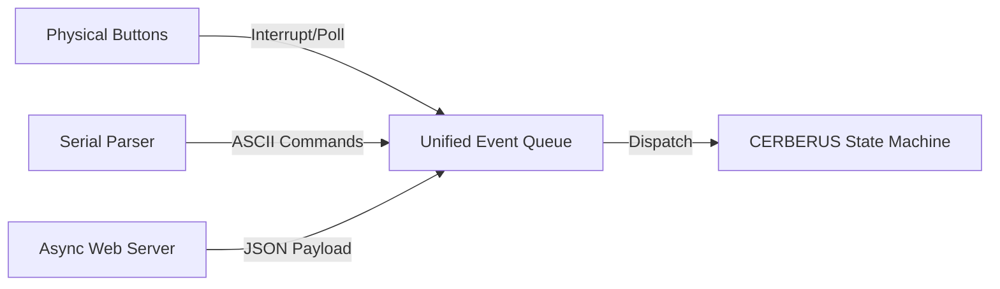

# System Specification: CERBERUS Multi-Gate Race Timer (ESP32 / CYD)

CERBERUS is a multi-gate timing system for micromouse-style runs. A central
controller (this project) runs on a Cheap Yellow Display (CYD) board and
combines local physical inputs, a serial link to a host PC, and a WiFi
station connection to a shared network (provided by a separate travel
router) that remote "intelligent gate" devices also connect to. The
controller is the definitive record for all run and session timing.

## Hardware Target
*   **MCU:** ESP32 or ESP32-S3 (Dual-core execution mode).
*   **Display & Touch:** Cheap Yellow Display (CYD) board featuring an SPI-driven TFT screen and an SPI-driven XPT2046 touch controller.
*   **Storage:** Onboard SD card slot sharing the SPI bus with the display and touch controller.
*   **Local inputs:** Four physical buttons (GPIO, touch, or Adafruit NeoKey I2C expander, depending on board -- see `USER-INPUT-SYSTEM.md`), mapped to `EV_ARM`, `EV_START`, `EV_GOAL`, `EV_NEW_MOUSE`.

---

## Core Architecture & Execution Model
The system uses an event-driven, decoupled, asynchronous architecture managed by FreeRTOS. Tasks communicate strictly via thread-safe FreeRTOS queues. To prevent race conditions and SPI bus panics, a Supervisory Control state structure assigns strict resource ownership.



### Core Assignment
*   **Core 0:** Reserved for the network stack, Wi-Fi station connection, and the Asynchronous HTTP Server engine. CERBERUS joins the shared network as a client (the AP is a separate travel router, not CERBERUS itself) and listens for `POST /api/event` from remote gates, parses JSON, and injects events into the queue with the gate's TSF timestamp.
*   **Core 1:** Runs the Main Application Task (Supervisor/State Machine, owns the display), the Local Input Polling Task (physical buttons), and the Serial Driver Task (host link).

### Debug Output Policy
The host UART is a single shared link doing double duty as the RACING-mode data protocol (event mirror, run-time reports, host override commands). Once the Serial Driver Task owns it, ad-hoc debug/diagnostic prints (`Serial.print`) must not also write to it -- an interleaved debug line would corrupt the host's parser. Route debug/status output to the display instead (e.g. a small on-screen debug line/panel) whenever the Serial Driver Task is active.

### Safe Memory & Data Structures
1.  **`SystemEvent` Struct:** A fixed-size struct passed strictly **by value** into the Main Event Queue. No dynamic allocation (`malloc`/`free`) is permitted, to completely eliminate heap fragmentation.

    ```c++
    enum EventType {
        EV_NONE,
        EV_NEW_MOUSE,
        EV_ARM,
        EV_START,
        EV_GOAL,
        EV_RESTART
    };

    struct SystemEvent {
        EventType type;
        uint64_t timestamp_us;  // TSF time if remote, local esp_timer_get_time() if local
        char payload[32];       // Mouse name (EV_NEW_MOUSE) or gate_id, depending on source
    };
    ```

    `EV_RESTART` has no dedicated physical button -- it is only ever raised via serial or HTTP command.

2.  **`LogMessage` Struct:** A fixed-size struct passed **by value** into the Logging Queue for sequential serialization. Its formatted CSV line is the single canonical representation of an event -- written to the SD file and mirrored to the host over serial without divergence (see Logging Infrastructure).

---

## Task Breakdown & Functional Specifications

### 1. Input Layer & Event Generation
*   **Local Input Polling Task (Core 1):** Polls the hardware GPIO buttons, the I2C NeoKey expander, and the SPI touch screen sequentially every 15ms (see `USER-INPUT-SYSTEM.md` for the producer-agnostic `ButtonID` dispatch already built). It handles debouncing entirely in software. Valid inputs map `BTN_ARM/BTN_START/BTN_GOAL/BTN_RESET` to `EV_ARM/EV_START/EV_GOAL/EV_NEW_MOUSE`, timestamped with the local `esp_timer_get_time()`, and pushed to the Main Event Queue as a `SystemEvent`.
*   **Asynchronous HTTP Listener (Core 0):** Connects to the shared WiFi network as a station and runs an async web server on that connection. Remote intelligent gates, also stations on the same network, send timing events to it as `POST /api/event` with a JSON body:

    ```json
    POST /api/event
    {
      "gate_id": "START_GATE",
      "event": "EV_START",
      "tsf_us": 4321098765,
      "gate_us": 1098765634
    }
    ```

    `tsf_us` is the gate's local reading of the shared hardware TSF clock at the moment of the event; `gate_us` is the gate's own free-running microsecond timer, used for drift-compensation cross-referencing (see below). The handler parses the JSON, constructs a `SystemEvent` (`timestamp_us = tsf_us`, `payload` = `gate_id`), and pushes it to the Main Event Queue. Implementation must be non-blocking and capable of handling back-to-back request spikes separated by as little as 20ms.
*   **Serial Monitor Task (Core 1):** Bidirectional owner of the host UART -- the sole task permitted to read or write it once RACING mode is live (see Debug Output Policy above). RX: blocks until a complete line terminates with an EOL (`\n`) marker; incoming messages are guaranteed to be under 64 bytes (e.g. `NEW_MOUSE:MightyMouse\n`). It parses the command string, populates a `SystemEvent` (timestamped locally), and pushes it to the Main Event Queue. TX: mirrors every generated race event and calculated run time back to the host in real time, using the same canonical line format the Logging Task writes to the SD card -- see Logging Infrastructure below.

Since events can arrive from any of the three sources above, each producer is responsible for normalizing into the common `SystemEvent` format before it reaches the queue -- the state machine never needs to know which source generated an event.

### 2. Main Processing, Supervisor & State Machine (Core 1 - High Priority)
*   **Resource Ownership:** The Main Application Task holds exclusive ownership over the Display driver (LovyanGFX) and the core Race Timing State Machine. No other task may write directly to the screen.
*   **Operation:** Loops on the Main Event Queue using a bounded-timeout `xQueueReceive` (not an indefinite block) so the task also wakes on a short tick (e.g. every 30-50ms) with no event pending -- required for the live Run Timer redraw below. When a real message is retrieved, it advances the state machine, writes directly to the display, and dispatches corresponding string metrics to the Logging Queue. On a timeout tick with no event, it just redraws the active timer(s); no state transition occurs.
*   **Supervisory States:** The application governs behavior through three top-level modes:
    *   `READY`: System is idle. Local inputs and remote HTTP triggers are actively monitored.
    *   `RACING`: System is capturing precise timing events, calculating laps, updating the UI, and streaming data to the log queue. Two timers run concurrently and are both displayed on screen:
        *   **Session Countdown Timer** -- counts down from a configurable duration (typically 5 or 7 minutes) for the whole `RACING` session. What happens when it reaches zero is deferred (open TODO).
        *   **Run Timer** -- zeroed on `EV_START`, stopped on `EV_GOAL`. While the state machine is waiting for the run-terminating event (`EV_GOAL`, `EV_ARM`, or `EV_RESTART`), this timer must redraw as fast as possible -- this is what the bounded-timeout receive loop above exists to support, since there is no guarantee an event arrives on every tick.
    *   `MAINTENANCE`: Triggered by a specific system command (e.g., log retrieval request). In this state, the task completely ignores all incoming race/lap timing triggers. It commands the Logging Task to close active file handles, releases file-system locks, and paints a "File Transfer Active" screen on the display.

    This is a separate, race-domain state machine from the UI-navigation `AppState` (`SUPERVISOR/RECALIBRATE_TOUCH/PLACEHOLDER`) already implemented in `app-modes.h`. `AppState` governs the on-screen menu system used to reach and configure sub-applications; `RACING` will be one such sub-application, added as a new `MODE_TABLE` entry. Once entered, it takes over the physical buttons -- `BTN_ARM/BTN_START/BTN_GOAL/BTN_RESET` stop meaning menu PREV/NEXT/ACTION and instead dispatch straight to `EV_ARM/EV_START/EV_GOAL/EV_NEW_MOUSE` in the race state machine, per the mapping in section 1.

    **Open TODO:** exact behavior when `EV_ARM` or `EV_RESTART` interrupts a Run Timer already in progress (freeze-and-record as an aborted run vs. discard) is not yet decided.

### 3. Logging Infrastructure (Core 1 - Low Priority)
*   **Operation:** Blocks on a 64-item FIFO Logging Queue.
*   **Serialization:** Pops raw event data and formats it into a single canonical CSV line (`LogMessage`). This exact line is (a) appended to the active file on the SD card over the SPI bus, and (b) handed to the Serial Driver Task to mirror to the host in real time during `RACING`. One formatter, two destinations -- the SD file and the live host stream are always byte-identical.
*   **Session replay:** Because the SD-logged line and the host-mirrored line are the same format, a saved `.CSV` session file can be replayed later over the serial link (e.g. `cat session.csv > /dev/ttyUSBn`) and reproduce an identical event/timing stream to host-side software, with no separate playback protocol needed.
*   **Bus Safety:** When the Supervisor state transitions to `MAINTENANCE`, the logging task completely flushes its buffer, closes its open file descriptor, and pauses all SD card SPI operations to completely yield the physical bus to the Wi-Fi file-streaming server.

### 4. File, Session, and Retrieval Management
*   **Boot Sequencing:** On startup, the system attempts to sync time via NTP. If no internet connection is reachable (e.g., the travel router has no upstream backhaul), the system falls back to reading an auto-incrementing boot counter stored in NVS (Non-Volatile Storage) flash memory.
*   **File Naming Rules:** Log files are safely separated by session and named sequentially: `/logs/RACE_NUM_[Counter].CSV` or timestamped via NTP if available. On every boot, a pointer file located at `/logs/LATEST.TXT` is rewritten with the string name of the currently active CSV log file.
*   **HTTP Log Streaming:** While the system is explicitly locked in the `MAINTENANCE` state, the HTTP server reads requested CSV logs from the SD card. Data must be served to the network in chunks, embedding short `vTaskDelay` yields to prevent starving background tasks and triggering the ESP32 Task Watchdog Timer (TWDT).

---

## Global Time Synchronization and Drift Mitigation

The Access Point (AP) -- a separate travel router, not the CERBERUS controller -- serves as the definitive timekeeper for the system, distributing a unified global clock across the network via the Timing Synchronization Function (TSF) data embedded in its 802.11 beacon frames. CERBERUS and every intelligent gate associate with this AP as ordinary WiFi stations and read its TSF clock the same way. So long as the AP remains online and does not reset, this TSF clock provides a monotonic, universally accessible time baseline for all system components.

However, physical deployment environments introduce edge cases: the AP may experience a transient failure or reset, and if the available network is part of a dynamic mesh topology, the absolute reference time may abruptly shift. Additionally, individual gates or the controller may occasionally miss beacon frames due to localized RF interference. During these blackout periods, a component's localized TSF clock begins to drift relative to the AP. While this drift is small -- typically on the order of 10 to 20 parts per million (ppm) -- it can still accumulate a discrepancy of just over one millisecond after one minute of independent running.

To counter these synchronization anomalies, both the intelligent gates and the CERBERUS controller simultaneously track their own internal 1MHz hardware timers (`esp_timer_get_time()`) alongside the incoming Wi-Fi TSF counter. By establishing a continuous, localized relationship between the stable internal microsecond clock and the absolute TSF clock, each component can dynamically model and compensate for clock drift or short-term beacon loss. This dual-clock cross-referencing (the `gate_us` field on every `POST /api/event`, cross-referenced against `tsf_us`) provides a robust fallback mechanism, preserving microsecond-level timing integrity even during a network disruption or an AP time shift for independent intervals up to five minutes.

Because the TSF clock is shared and synchronized across all devices at the hardware level, timestamps attached to remote gate messages are considered absolute -- network transmission latency ceases to be an issue, ensuring accurate time-stamping regardless of network jitter. Serial messages from the host and local button presses are never TSF-timestamped by their source; the controller assigns them a local `esp_timer_get_time()` reading on arrival (see `SystemEvent.timestamp_us` above), since the controller itself always has access to the global TSF time.

**Open TODO:** how gates discover CERBERUS's IP address to POST events to (static/reserved IP on the travel router vs. mDNS) is not yet decided -- deferred until the travel router hardware is in hand.

---

## Coding Requirements
Generate clean, highly modular, thread-safe C/C++ code utilizing the Arduino-ESP32 core framework. Ensure all SPI bus transactions are properly guarded, FreeRTOS queue API interactions check for timeout constraints, and no dynamic memory allocation is used inside the execution path. No task or module may write ad-hoc debug output to the host UART once the Serial Driver Task owns it -- see Debug Output Policy.
