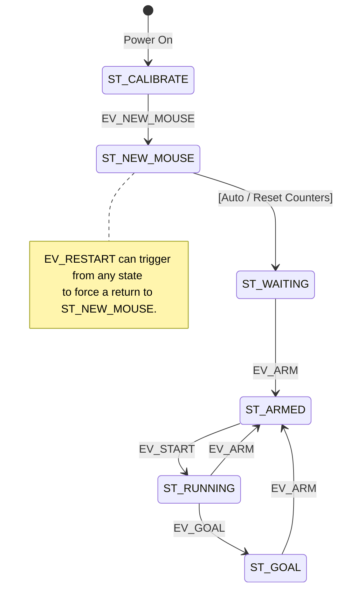

# MICROMOUSE TIMING SYSTEM V2

The original state machine description for the timing system was writte assuming that the detection of the mouse and the handling of the timing were all done by the same controller.

In the current, and proposed, system, these are separate concerns. The gate hardware monitors the gates and will generate appropriate events as the individual gates are occluded. 

The start gate controller must monitor both the home cell presence detector and the start exit sensor and decide exactly what their conditions mean in terms of events. Mostly this is clear but there are edge cases where a robot may occlude both detectors at the same time. A specific case occurs when the robot leaves the start cell. If it were to immediately back up for some reason, that might look like an abandoned run.

The goal gate should handle a single entrance to the goal area. Provision should be made for more than one goal gate. Each could generate an identical goal event.

By arranging for the gate controller to be event driven, we are able to generate those events by a variety of means:

  - Serial messages from the host computer
  - Button presses on the gate controller front panel
  - HTTP requests over WiFi from the gates
  - Direct logic inputs.

## Gate Controller State Machine (CERBERUS)

* **ST_CALIBRATE**
  * After a power-on or system reset, the gate controller will clear all counters and establish communication with the host computer and the individual gates.
  * If persistent storage is enabled, a new file will be created, either using SPIFFS or an SD card if present.
  * Once complete, it awaits a new mouse event from the host, or a button on the front panel.
  * All other events are ignored.

* **ST_NEW_MOUSE**
  * When a new mouse is signalled, the gate controller will reset the run and timing counters.
  * If persistent storage is enabled, any open record will be closed, and a new record will be created for the mouse using the name provided by the host. In the absence of a name, a simple sequential identifier will be used.
  * The EV_NEW_MOUSE event can be generated at any time to bring the gate controller back to this state.
  * Transition to ST_WAITING is automatic.

* **ST_WAITING**
  * In the waiting state, the gate controller does nothing except wait for an EV_ARM event generated either by the home gate being occluded, or the pressing of the ARM button on the front panel.

* **ST_ARMED**
  * On entering the ARMED state, the gate controller checks to see if this is the first time for this mouse. If so, it starts the contest_time counter and sets the run counter to zero.
  * Only the EV_START and EV_NEW_MOUSE events allow exit from ARMED.

* **ST_RUNNING**
  * On entry to the ST_RUNNING state, the gate controller starts the run timer and increments the run count.
  * While running, only three events are recognized:
    * The global EV_NEW_MOUSE
    * EV_GOAL, which passes control to ST_GOAL to record the run
    * EV_ARM, which takes the controller back to ST_ARMED
  * Returning to ST_ARMED via EV_ARM is the normal sequence if a crashed mouse is replaced in the start cell.
  * Care must be taken if unusual activity in or near the start square causes the robot to back up immediately after a START event, potentially triggering a false re-arm. Because the HOME and START gates are monitored by the same gate hardware, a short lockout period will be needed after a START event during which the EV_ARM event is disabled.Getting the correct messages generated is the responsibility of the gate hardware.

* **ST_GOAL**
  * On entry to the GOAL state, the system records the run time. It then remains in this state, holding the recorded time and waiting for a fresh EV_ARM event to re-arm the controller for another run.
  * We might optionally detect a sequence where a robot passes back through the start gate and then re-arms the system, implying a run completed entirely without manual intervention.

